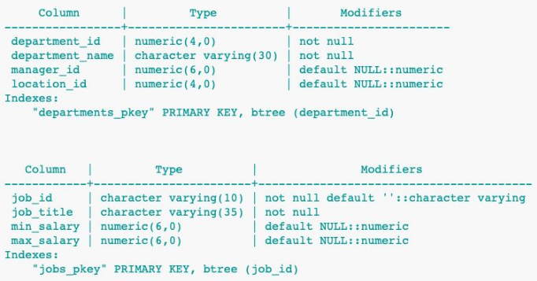
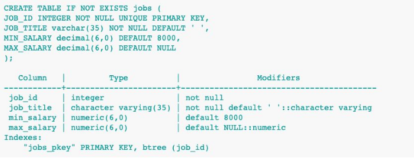
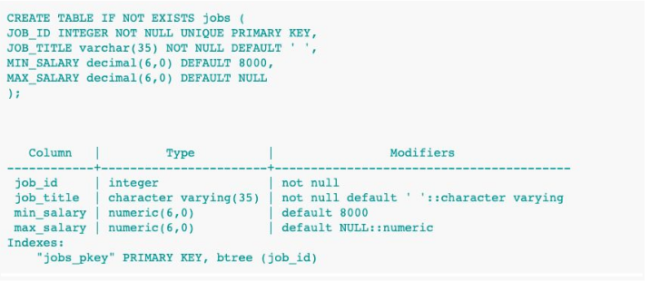
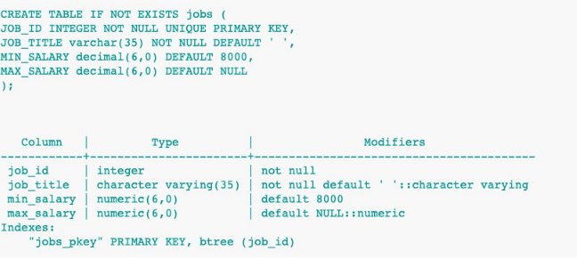
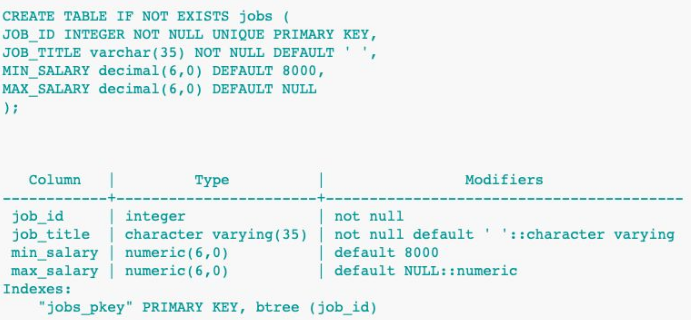
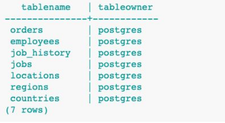
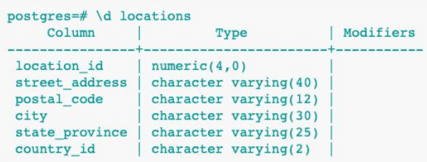
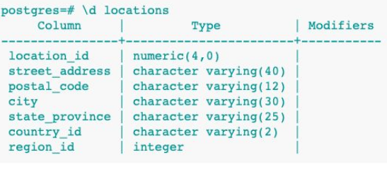

# Topic:​ SQL + PostgreSQL Exercises
Based on the knowledge learned in the SQL + PostgreSQL Exercises
course, complete the following exercises:

Solve the following challenges, at the end you must upload them to
your Github.

`$ docker-compose up -d`

`$ docker exec -it sql-postgresql_exercises_db_1 psql -U cristian0 Countries`

1. Write a SQL statement to create a simple table countries including columns
country_id,country_name and region_id.

`Countries-# \i /home/script1.sql`

2. Write a SQL statement to create a simple table countries including columns
country_id,country_name and region_id which already exist.

`Countries-# \i /home/script1.sql`

3. Write a SQL statement to create the structure of a table dup_countries
similar to countries.
4. Write a SQL statement to create a duplicate copy of countries table
including structure and data by name dup_countries.
5. ​ Write a SQL statement to create a table countries set a constraint NULL.
6. Write a SQL statement to create a table named jobs including columns
job_id, job_title, min_salary, max_salary and check whether the max_salary
amount exceeding the upper limit 25000.
7. ​ Write a SQL statement to create a table named countries including columns
country_id, country_name and region_id and make sure that no countries
except Italy, India and China will be entered in the table.
8. ​ Write a SQL statement to create a table named countries including columns
country_id,country_name and region_id and make sure that no duplicate data
against column country_id will be allowed at the time of insertion.
9. ​ Write a SQL statement to create a table named jobs including columns
job_id, job_title, min_salary and max_salary, and make sure that, the default
value for job_title is blank and min_salary is 8000 and max_salary is NULL will
be entered automatically at the time of insertion if no value assigned for the
specified columns.
10. ​ Write a SQL statement to create a table named countries including
columns country_id, country_name and region_id and make sure that the
country_id column will be a key field which will not contain any duplicate data
at the time of insertion.
11. ​ Write a SQL statement to create a table countries including columns
country_id, country_name and region_id and make sure that the column
country_id will be unique and store an auto-incremented value.
12. ​ Write a SQL statement to create a table countries including columns
country_id, country_name and region_id and make sure that the combination
of columns country_id and region_id will be unique.
13. ​ Write a SQL statement to create a table job_history including columns
employee_id, start_date, end_date, job_id and department_id and make sure
that, the employee_id column does not contain any duplicate value at the time
of insertion and the foreign key column job_id contain only those values which
exist in the jobs table.
Here is the structure of the table jobs;

14. ​ Write a SQL statement to create a table employees including columns
employee_id, first_name, last_name, email, phone_number hire_date, job_id,
salary, commission, manager_id and department_id and make sure that, the
employee_id column does not contain any duplicate value at the time of
insertion and the foreign key columns combined by department_id and
manager_id columns contain only those unique combination values, which
combinations exist in the departments table.
Assume the structure of departments table below.

15. ​ Write a SQL statement to create a table employees including columns
employee_id, first_name, last_name, email, phone_number hire_date, job_id,
salary, commission, manager_id and department_id and make sure that, the 
employee_id column does not contain any duplicate value at the time of
insertion, and the foreign key column department_id, reference by the column
department_id of departments table, can contain only those values which are
exist in the departments table and another foreign key column job_id,
referenced by the column job_id of jobs table, can contain only those values
which exist in the jobs table.
Assume that the structure of two tables departments and jobs.

16. ​ Write a SQL statement to create a table employees including columns
employee_id, first_name, last_name, job_id, salary and make sure that, the
employee_id column does not contain any duplicate value at the time of
insertion, and the foreign key column job_id, referenced by the column job_id
of jobs table, can contain only those values which exist in the jobs table. The
specialty of the statement is that the ON UPDATE CASCADE action allows
you to perform the cross-table update and ON DELETE RESTRICT action
rejects the deletion. The default action is ON DELETE RESTRICT.

17. ​ Write a SQL statement to create a table employees including columns
employee_id, first_name, last_name, job_id, salary and make sure that, the
employee_id column does not contain any duplicate value at the time of
insertion, and the foreign key column job_id, referenced by the column job_id
of jobs table, can contain only those values which exist in the jobs table. The
specialty of the statement is that the ON DELETE CASCADE that lets you
allow to delete records in the employees(child) table that refers to a record in
the jobs(parent) table when the record in the parent table is deleted and the
ON UPDATE RESTRICT actions reject any updates.
Assume that the following is the structure of the table jobs.

18. ​ Write a SQL statement to create a table employees including columns
employee_id, first_name, last_name, job_id, salary and make sure that, the
employee_id column does not contain any duplicate value at the time of
insertion, and the foreign key column job_id, referenced by the column job_id
of jobs table, can contain only those values which exist in the jobs table. The
specialty of the statement is that the ON DELETE SET NULL action will set
the foreign key column values in the child table(employees) to NULL when the
record in the parent table(jobs) is deleted, with a condition that the foreign key
column in the child table must accept NULL values and the ON UPDATE SET
NULL action resets the values in the rows in the child table(employees) to
NULL values when the rows in the parent table(jobs) are updated.
Assume that the following is the structure of two table jobs.

19. ​ Write a SQL statement to create a table employees including columns
employee_id, first_name, last_name, job_id, salary and make sure that, the
employee_id column does not contain any duplicate value at the time of
insertion, and the foreign key column job_id, referenced by the column job_id
of jobs table, can contain only those values which exist in the jobs table. The
specialty of the statement is that, The ON DELETE NO ACTION and the ON
UPDATE NO ACTION actions will reject the deletion and any updates.
Assume that the following is the structure of two table jobs.

20.​ Write a SQL statement to rename the table countries to country_new.

21.​ Write a SQL statement to add a column region_id to the table locations.
Here is the structure of the table locations.

22.​ Write a SQL statement to change the data type of the column region_id to
text in the table locations.
Here is the structure of the table locations.

